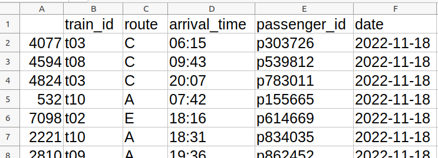

# Are the trains busy or not?

# - a data science challenge

A data set and a conundrum, designed to teach fundamental data science concepts of data wrangling.
CC-BY Zahra Arjmandi & [Tom Stafford](https://tomstafford.sites.sheffield.ac.uk/), 2023

## The challenge

Passengers on City Trains complain that most journeys they take are too crowded. City Trains say that most journeys are less than half full. Who is right, and why?

## The data

Looks like this

Each row reflects data on a particular journey. The variables in the columns are

>**train_id** - an ID code for the train taking the journey
>	
>**route** - the route
>
>**arrival_time** - the arrival time
>
>**passenger_id** - an ID code for the passenger taking the journey
>	
>**date** - the date of the journey

Download the data here: [train_data.csv](train_data.csv)

## What you'll learn

The interesting questions in data analysis help you better understand the question, as much as they provide interesting answers. We believe you'll learn the most if you just have a go at answering the question in any way you think approrpiate. If you're not up for that, we've provided some brief [answer notes](answers.pdf)
